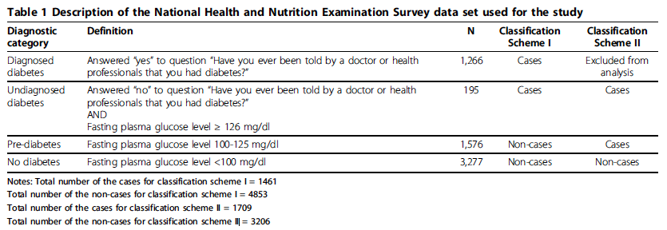

# NHANES Diabetes & Pre-Diabetes Prediction

## Abstract
> In this study, we used a 1999-2004 data set from the National Health and Nutrition Examination Survey (NHANES) to generate the SVM algorithm. NHANES is an ongoing, cross-sectional, probability sample survey of the U.S. population. It collects demographic, health history, and behavioral information from participants in home interviews. Participants are also invited for detailed physical, physiological, and laboratory examinations that are performed by trained personnel in specially equipped mobile centers.

> We limited our study to non-pregnant participants aged 20 or older. Participants were considered to have diagnosed diabetes if they answered “yes” to the question “Have you ever been told by a doctor or health professionals that you have diabetes?” Participants who answered “no” to this question but who had a measured fasting plasma glucose ≥ 126 mg/dl were considered to have undiagnosed diabetes; those with a fasting plasma glucose 100-125 mg/dl were considered to have pre-diabetes. Participants with fasting glucose <100 mg/dl were considered to not have diabetes

> We devised two different classification schemes (Table 1). In Classification Scheme I, the group of persons with diabetes (diagnosed or undiagnosed) was distinguished from those without diabetes, including persons with pre-diabetes. In Classification Scheme II, the group of persons with either undiagnosed diabetes or pre-diabetes was distinguished from those without diabetes. The models were developed using a sample of 80% of the individuals in each group and validated in the remaining 20%.

## Class Definitions

## Features and Descriptions

* `ALQ120Q`: [How often drink alcohol over past 12 mos](http://wwwn.cdc.gov/Nchs/Nhanes/1999-2000/ALQ.htm#ALQ120Q)
* `BMXBMI`: [Body Mass Index (kg/m**2)](http://wwwn.cdc.gov/Nchs/Nhanes/1999-2000/BMX.htm#BMXBMI)
* `BMXHT`: [Standing Height (cm)](http://wwwn.cdc.gov/Nchs/Nhanes/1999-2000/BMX.htm#BMXHT)
* `BMXLEG`: [Upper Leg Length (cm)](http://wwwn.cdc.gov/Nchs/Nhanes/1999-2000/BMX.htm#BMXLEG)
* `BMXWAIST`: [Waist Circumference (cm)](http://wwwn.cdc.gov/Nchs/Nhanes/1999-2000/BMX.htm#BMXWAIST)
* `BMXWT`: [Weight (kg)](http://wwwn.cdc.gov/Nchs/Nhanes/1999-2000/BMX.htm#BMXWT)
* `BPQ020`: [Ever told you had high blood pressure](http://wwwn.cdc.gov/Nchs/Nhanes/1999-2000/BPQ.htm#BPQ020)
* `DMDEDUC2`: [Education Level - Adults 20+](http://wwwn.cdc.gov/Nchs/Nhanes/1999-2000/DEMO.htm#DMDEDUC2)
* `INDHHINC`: [Annual Household Income](http://wwwn.cdc.gov/Nchs/Nhanes/1999-2000/DEMO.htm#INDHHINC)
* `LBXTC`: [Total cholesterol (mg/dL)](http://wwwn.cdc.gov/Nchs/Nhanes/1999-2000/LAB13.htm#LBXTC)
* `MCQ250A`: [Blood relatives have diabetes](http://wwwn.cdc.gov/Nchs/Nhanes/1999-2000/MCQ.htm#MCQ250A)
* `PAQ180`: [Avg level of physical activity each day](http://wwwn.cdc.gov/Nchs/Nhanes/1999-2000/PAQ.htm#PAQ180)
* `RIAGENDR`: [Gender](http://wwwn.cdc.gov/Nchs/Nhanes/1999-2000/DEMO.htm#RIAGENDR)
* `RIDAGEYR`: [Age at Screening Adjudicated - Recode](http://wwwn.cdc.gov/Nchs/Nhanes/1999-2000/DEMO.htm#RIDAGEYR)
* `RIDRETH1`: [Race/Ethnicity - Recode](http://wwwn.cdc.gov/Nchs/Nhanes/1999-2000/DEMO.htm#RIDRETH1)
* `SMD030`: [Age started smoking cigarets regularly](http://wwwn.cdc.gov/Nchs/Nhanes/1999-2000/SMQ.htm#SMD030)

## Additional Variables

* [Variable search](http://wwwn.cdc.gov/Nchs/Nhanes/Search/default.aspx)
* [Demographic data](http://wwwn.cdc.gov/Nchs/Nhanes/Search/DataPage.aspx?Component=Demographics) - [variable list](http://wwwn.cdc.gov/nchs/nhanes/search/variablelist.aspx?Component=Demographics)
* [Dietary](http://wwwn.cdc.gov/Nchs/Nhanes/Search/DataPage.aspx?Component=Dietary) - [variable list](http://wwwn.cdc.gov/nchs/nhanes/search/variablelist.aspx?Component=Dietary)
* [Examination](http://wwwn.cdc.gov/Nchs/Nhanes/Search/DataPage.aspx?Component=Examination) - [variable list](http://wwwn.cdc.gov/nchs/nhanes/search/variablelist.aspx?Component=Examination)
* [Laboratory](http://wwwn.cdc.gov/Nchs/Nhanes/Search/DataPage.aspx?Component=Laboratory) - [variable list](http://wwwn.cdc.gov/nchs/nhanes/search/variablelist.aspx?Component=Laboratory)
* [Questionnaire](http://wwwn.cdc.gov/Nchs/Nhanes/Search/DataPage.aspx?Component=Questionnaire) - [variable list](http://wwwn.cdc.gov/nchs/nhanes/search/variablelist.aspx?Component=Questionnaire)